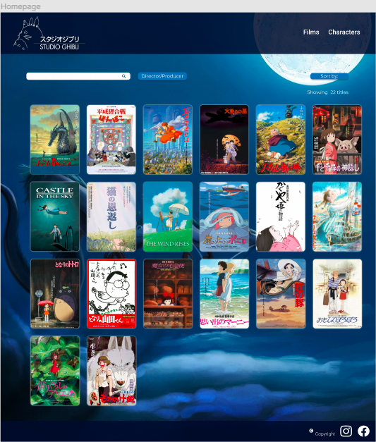

# Descripción del proyecto
El proyecto consiste en una página web que permita visualizar un conjunto de datos sobre Studio Ghibli que se adecúa a las necesidades del Usuario que busque acceder a la data, filtrarla, ordenarla y además mostrar cálculo de cómo se ve afectada la data según los filtros, cuya información es tomada de la Data recibida.

Se aplican una serie de datos sobre Studio Ghibli, entendiendo la necesidad de usuarios de obtener más información sobre sus películas favoritas,locaciones y vehículos, así como personajes, y sus características más relevantes. Es por ello que se diseña una interfaz que permita aplicar filtros, poder ordenar la información obtenida y que además sea "responsive".

En el conjunto de datos mostrados, encontramos 22 películas, con sus respectivos personajes y locaciones, y en caso de tener, sus vehículos.

# Historias de Usuario:

**Perfil de Usuario:**
Personas interesadas en obtener más información sobre sus películas favoritas, personajes, locaciones y vehículos de Studio Ghibli, con la necesidad de poder accededer a la data, a través de la interación con la aplicación.

# Visualización:
La interfaz de la aplicación debe ser llamativa, y permitir al usuario utilizarla, aún en caso de que no domine el idioma, además debe estar acorde a su contenido, ya que Studio ghibli se caracteriza por sus animaciones.
Lograr que la experiencia de usuario sea intuitiva, permitiéndole acceder a la información que desee, mediante filtros, por ejemplo, de una forma sencilla y amigable.

**Diseño de interfaz (*Proceso de Diseño*):**

1. Consideraciones generales:
   * Analizar tipografías.
   * Selección de paleta de colores. (color, contraste)
   * Composición.
   * Experiencia de usuario.
   * Feedback, a través de terceros para identificar fallas en el diseño de la interfaz y aplicar cambios Spertinentes, a través de Sprint review y Retrospectiva.

2. De acuerdo a la data recibida y teniendo en cuentas las necesidades del usuario se aplican los siguientes pasos en el diseño de la interfaz:
	- Se selecciona una paleta de colores en tonos azules acorde al concepto de Ghibli, cuyo nombre se inspira en el cielo, el viento y volar (aviones).
	- Se realiza boceto en baja fidelidad que presenta una home page, donde el usuario puede visualizar la totalidad de las películas.
	- Se realiza un boceto de baja fidelidad que presenta cómo se mostraría la información de una película, y además el despliegue de información sobre un personaje.
	- Se procede a realizar toma de feedback, para realizar prototipos de alta fidelidad, tanto para home page, como para película e información de personajes.
	- Se diseña en alta fidelidad un prototipo para versión movil, que se adapte a la premisa de "responsive".

3. Resultado:
   - La aplicación muestra una homepage, que permite al usuario navegar a través de los posters de las películas de Studio Ghibli.
   - Permite al usuario aplicar filtros, lo que le facilita encontrar la información que desea, ya que puede buscar a sus personajes favoritos, a través de un buscador.
   - Permite al usuario ordenar las películas, por sus directores/productores, años de lanzamientos, rating y alfabéticamente. O encontrarlas a través de un buscador.

**Prototipos :**
   [Enlace a Figma](https://www.figma.com/file/wnPznJtjqGAKLOSSewKmeg/Data-Lovers-Copy?node-id=0%3A1)

   

4. Definición de listo (17/06 al 23/06):
   [X]Hacer skecth de baja fidelidad.
[X]Hacer skecth em Figma.
[X]Feedback.
[X]Sprint y retrospectiva.
[X]Ajustar plan de Acción.
[X]Figma definitivo, ajustado a plan de Acción producto del feedback.
[X]Sprint checkout (entrega de resultados de retrospectiva).

# Ordenar:

# Filtrar:

# Calcular

# Test de Usabilidad:
A través de la toma de feedback, se realizan los siguientes cambios:
- Se cambia la paleta de color seleccionada inicialmente, aplicando una nueva mantiendo el tema inicial.
- Se agregan los títulos de las películas en el homepage, para que el usuario pueda identificarlas mejor.
- Se realiza test de usabilidad para determinar cuántas películas mostrar en la versión móvil del homepage con los siguientes resultados:
	* "Un póster es demasiado grande, hace incoveniente buscar una película sin usar los filtros"
	* "No molestan tres poster, pero dificulta ubicar una película visualmente"
	* "Mostrar dos películas me parece lo más óptimo"
- Se agrega un botón para reset de filtros.